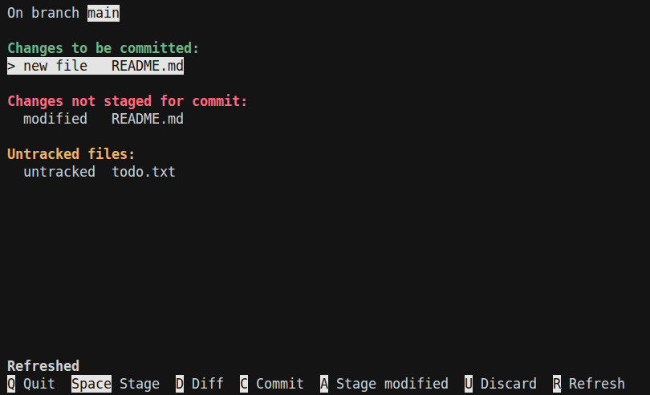

# Interactive Git Status

Screenshot: 

Installation:

```bash
sudo wget https://raw.githubusercontent.com/fotcorn/interactive-git-status/refs/heads/main/igs.py -O /usr/local/bin/igs && \
sudo chmod a+x /usr/local/bin/igs
```
